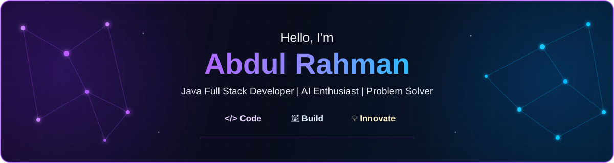

  

---

## 👨‍💻 About Me

I'm Abdul Rahman, a B.Tech Artificial Intelligence and Data Science student
interested in Web Development, MERN Stack, Artificial Intelligence,
Data Science, and emerging technologies.

I chose Artificial Intelligence and Data Science because I was curious
about how AI works and how data can be used to solve real-world problems.
I enjoy learning how technology can be applied to practical challenges
and continuously exploring new tools, software, and technologies.

I'm also interested in Web Development because I enjoy creating
applications that can be useful in real-world situations. I like
understanding how frontend and backend technologies work together to
build complete applications.

I am currently exploring Blockchain Technology, its fundamentals,
security concepts, and practical applications, while also experimenting
with emerging AI models and tools.

My goal is to continuously learn, build meaningful projects, improve my
problem-solving skills, and grow as a software developer who can
contribute effectively to a team.

---

## 🎓 Education

**B.Tech in Artificial Intelligence and Data Science**  
Dr. NGP Institute of Technology, Coimbatore  
**4th Year — Final Year | Expected Graduation: 2027**

---

## 🎯 Currently Exploring

- Strengthening my problem-solving, programming, and software development skills.
- Building practical, real-world solutions using the MERN Stack.
- Improving my understanding of frontend and backend development and how they work together.
- Exploring Blockchain Technology, including its concepts, security, and practical applications.
- Exploring emerging AI models, AI tools, and new technologies to understand their real-world use cases.
- Continuously learning and experimenting with new software, tools, and technologies.

---

## 🚀 What I'm Building

- Developing real-world web applications using the MERN Stack.
- Working on projects that focus on solving practical problems through technology.
- Experimenting with AI models and tools to explore useful AI-powered solutions.
- Exploring blockchain concepts and their potential applications in real-world systems.
- Combining my knowledge of AI, web development, and emerging technologies to build meaningful projects.

---

## 💡 My Approach

I believe in learning by building, experimenting, and continuously improving.

- Learn the fundamentals before moving to advanced concepts.
- Build projects to turn knowledge into practical experience.
- Explore new technologies and understand their real-world applications.
- Focus on writing clean, understandable, and maintainable code.
- Learn from challenges, mistakes, and feedback.
- Continuously improve both technical and problem-solving skills.

---

# 🛠️ Tech Stack

## 💻 Programming Languages

  

## 🌐 Frontend

  

## ⚙️ Backend

  

## 🗄️ Database

  

## 🤖 AI & Data Science

- Artificial Intelligence
- Machine Learning
- Deep Learning
- Natural Language Processing (NLP)
- Computer Vision
- Generative AI
- Predictive Modeling
- Data Analysis
- Data Visualization

### Data Science Tools

  

**Libraries & Tools:** NumPy • Pandas • Scikit-learn

**Generative AI:** Project Experience

## ⛓️ Blockchain

- Blockchain Fundamentals
- Block & Blockchain Structure
- Hashing & SHA-256
- Decentralization
- Distributed Ledger
- Consensus Mechanisms
  - Proof of Work (PoW)
  - Proof of Stake (PoS)
- Bitcoin & Cryptocurrency
- Smart Contracts
- Ethereum
- Blockchain Applications
- Public Blockchain
- Private Blockchain
- Consortium Blockchain
- Hybrid Blockchain

## ☁️ Cloud & Platforms

- AWS — Fundamentals
- Microsoft Azure — Fundamentals

## 🛠️ Development Tools

  

## 🤖 AI-Assisted Development

**Claude • Lovable • Emergent**

---

# 🏆 Achievements & Certifications

## 🏅 Achievements

- **VIHANSA 2K26** — 24-Hour National Level Hackathon
  - Sri Ramakrishna Institute of Technology, Coimbatore
  - Problem: Social Media Sentiment Analysis
  - Classification: Positive, Negative, Neutral

- Participated in **TECHNOVA '26** National-Level Hackathon

- Participated in **VIHANSA 2K26** National-Level Hackathon

- Presented research paper at **ICRIT '26**
  - *Integrated Cooperative Farming System with Farmer Connectivity and Crop Recommendation*

## 📜 Certifications

- **NPTEL Elite — Human Computer Interaction**
  - IIIT Delhi • **86%** • 2026

- **NPTEL Elite — Design & Implementation of Human-Computer Interfaces**
  - IIT Guwahati • **61%** • 2025

- **NPTEL — Privacy and Security in Online Social Media**
  - IIIT Hyderabad • **57%** • 2025

- **Foundations of Cyber Security: Threats, Tools & Practical Defense**
  - ISEA Project Phase-III

## 💼 Internship

**Web Development Intern**  
**ATS — Aalan Tech Soft, Software Development & Trainings**

**09 June 2025 – 25 June 2025 | 17 Days**

---

# 📊 GitHub Statistics

  

  

### 🐍 Contribution Snake

  

---

# 🚀 Featured Projects

<table>
<tr>

<td width="50%">

### 🤖 NarratoVision

A Generative AI application that understands emotions from text and generates related visual content.

**Python • Streamlit • NLP • Generative AI**

<a href="https://github.com/Abdul-stack871/NarratoVission-AI">
  🔗 View Project
</a>

</td>

<td width="50%">

### 🏠 StayMate AI

An AI-powered platform designed to help students and working people find affordable accommodation and suitable roommates.

**Web Development • AI**

<a href="https://github.com/Abdul-stack871/Stay-Mate">
  🔗 View Project
</a>

</td>

</tr>
</table>

---

# 🔗 Connect With Me

---

<i>Building • Learning • Exploring • Improving</i>

  

Thanks for visiting my profile! 🚀

