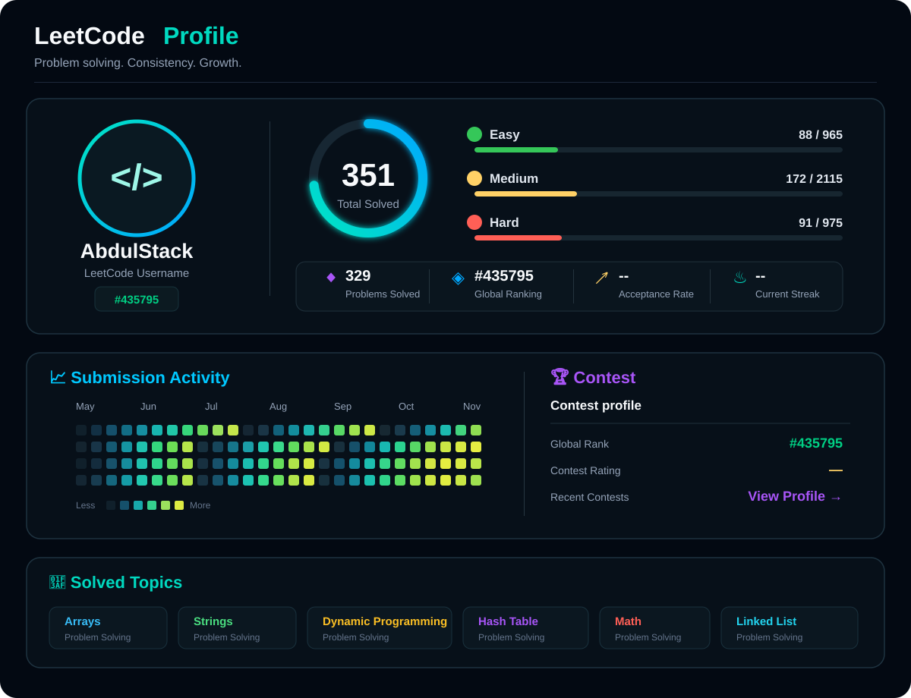

  

---

## 👨‍💻 About Me

I'm Abdul Rahman, a B.Tech AI & Data Science student passionate about
building practical web applications and exploring AI-driven solutions.

I enjoy working with MERN Stack, Artificial Intelligence, Data Science,
and emerging technologies — learning by building, experimenting, and solving
real-world problems.

Currently exploring Blockchain fundamentals and emerging AI models while
continuously improving my development and problem-solving skills.

---

## 🎓 Education

**B.Tech in Artificial Intelligence and Data Science**  
Dr. NGP Institute of Technology, Coimbatore  
**4th Year — Final Year | Expected Graduation: 2027**

---

<b>🎯 Currently Exploring</b>

 

- Strengthening my programming, problem-solving, and software development skills.
- Building practical solutions using the MERN Stack.
- Exploring Blockchain fundamentals and practical applications.
- Exploring emerging AI models, AI tools, and new technologies.
- Improving my understanding of modern software development.

<b>🚀 What I'm Building</b>

 

- Real-world web applications using the MERN Stack.
- AI-powered solutions for practical problems.
- Projects combining AI, web development, and emerging technologies.
- Applications focused on useful real-world solutions.

<b>💡 My Approach</b>

 

- Learn by building.
- Understand the fundamentals.
- Experiment with new technologies.
- Solve practical problems.
- Learn from challenges and improve continuously.

---

# 🛠️ Tech Stack

### 💻 Languages

  

### 🌐 Frontend

  

### ⚙️ Backend

  

### 🗄️ Database

  

### 🧰 Development Tools

  

### 🤖 AI-Assisted Development

`Claude` • `Lovable` • `Emergent`

<b>🤖 AI & Data Science</b>

 

**Core Areas**

`Artificial Intelligence` • `Machine Learning` • `Deep Learning`  
`NLP` • `Computer Vision` • `Generative AI` • `Predictive Analytics`

**Tools & Libraries**

`Python` • `NumPy` • `Pandas` • `Scikit-learn`

<b>⛓️ Blockchain</b>

 

**Fundamentals**

`Blockchain` • `Hashing` • `Distributed Ledger` • `Decentralization`

**Consensus**

`Proof of Work (PoW)` • `Proof of Stake (PoS)`

**Concepts**

`Smart Contracts` • `Ethereum` • `Bitcoin` • `Public Blockchain`  
`Private Blockchain` • `Consortium Blockchain` • `Hybrid Blockchain`

<b>☁️ Cloud Fundamentals</b>

 

`AWS` • `Microsoft Azure`

---

# 🏆 Achievements & Certifications

<b>🏅 Achievements</b>

 

- **VIHANSA 2K26** — 24-Hour National Level Hackathon
  - Sri Ramakrishna Institute of Technology, Coimbatore
  - Social Media Sentiment Analysis
  - Positive / Negative / Neutral Classification

- **TECHNOVA '26** — National-Level Hackathon Participant

- **VIHANSA 2K26** — National-Level Hackathon Participant

- **ICRIT '26** — Research Paper Presentation
  - *Integrated Cooperative Farming System with Farmer Connectivity and Crop Recommendation*

<b>📜 Certifications</b>

 

- **NPTEL Elite — Human Computer Interaction**
  - IIIT Delhi • **86%** • 2026

- **NPTEL Elite — Design & Implementation of Human-Computer Interfaces**
  - IIT Guwahati • **61%** • 2025

- **NPTEL — Privacy and Security in Online Social Media**
  - IIIT Hyderabad • **57%** • 2025

- **Foundations of Cyber Security: Threats, Tools & Practical Defense**
  - ISEA Project Phase-III

<b>💼 Internship Experience</b>

 

**Web Development Intern**  
**ATS — Aalan Tech Soft, Software Development & Trainings**

**09 June 2025 – 25 June 2025 | 17 Days**

---

# 📊 Developer Dashboard

  <i>A snapshot of my coding journey across GitHub & LeetCode</i>

### 🐙 GitHub Overview

  

  

  

---

## 🐍 Contribution Snake

  

---

# 🚀 Featured Projects

<table>
<tr>

<td width="50%" valign="top">

### 🤖 NarratoVision

A Generative AI application that analyzes emotions from text and generates related visual content.

**Python • Streamlit • NLP • Generative AI**

 

<a href="https://github.com/Abdul-stack871/NarratoVission-AI">
  🔗 View Project
</a>

</td>

<td width="50%" valign="top">

### 🏠 StayMate AI

An AI-powered platform designed to help students and working people find affordable accommodation and suitable roommates.

**Web Development • AI**

 

<a href="https://github.com/Abdul-stack871/Stay-Mate">
  🔗 View Project
</a>

</td>

</tr>
</table>

---

# 🔗 Connect With Me

---

### Code. Learn. Improve. Repeat. 🚀

<i>Building practical solutions and exploring what's next.</i>

